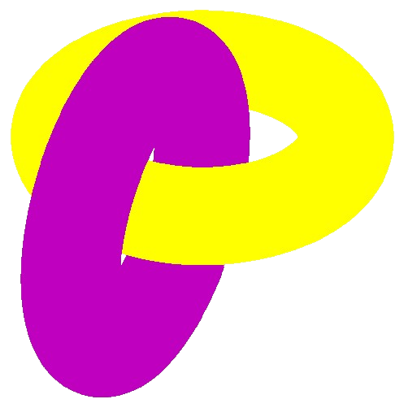
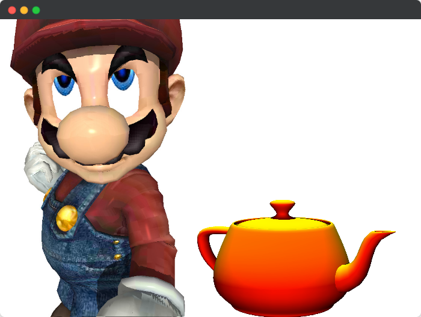

<!-- PROJECT LOGO -->
<br />
<div align="center">
  <a href="https://github.com/AchrafYndz/graphics-engine">
    
  </a>

<h3 align="center">graphics-engine</h3>
  <p align="center">
    A graphics engine built with C++.
    <br />
    <a href="https://github.com/AchrafYndz/graphics-engine/issues">Report Bug</a>
    ·
    <a href="https://github.com/AchrafYndz/graphics-engine/issues">Request Feature</a>
  </p>
</div>


<!-- ABOUT THE PROJECT -->

## About The Project

This project is a graphics engine built from scratch with C++, without the use of any libraries.

<p align="center">
  
</p>

### Built With

[![CPP][cpp.com]][cpp-url]


<!-- GETTING STARTED -->

## Getting Started

To get a local copy up and running follow these simple steps.

### Prerequisites

* C++ compiler
* CMake

### Installation

1. Clone the repo

```sh
   git clone git@github.com:AchrafYndz/graphics-engine.git
```
2. Build the project

#### Executing the Project:

1. Navigate to the `cmake-build-debug` directory by executing the command `cd cmake-build-debug`.
2. Execute the engine binary with an argument that specifies the path to the desired ini file. The command should look like this: `./engine [path_to_ini_file]`.

For example, if you want to run the project with the `3d_fractals001.ini` file, the command would be: `./engine ../ini/3d_fractals/3d_fractals001.ini`.
The resulting image will be generated and saved as `out.bmp` in the current directory.

Alternatively, if you want to process multiple ini files at once, you can use a `filelist`:
1. Change your working directory to the one that contains the `filelist`.
2. Execute the engine binary without any arguments.
The resulting images will be generated and saved with the same name as their ini files.

<!-- FEATURES -->

## Features

* 3D Fractals
* Ambient Lighting
* L-systems
* Z-buffering
* Wireframes
* 2D shapes
* Line Drawings
* and more...

<!-- CONTRIBUTING -->

## Contributing

Contributions are what make the open source community such an amazing place to learn, inspire, and create. Any
contributions you make are **greatly appreciated**.

If you have a suggestion that would make this better, please fork the repo and create a pull request. You can also
simply open an issue with the tag "enhancement".
Don't forget to give the project a star! Thanks again!

1. Fork the Project
2. Create your Feature Branch (`git checkout -b feature/AmazingFeature`)
3. Commit your Changes (`git commit -m 'Add some AmazingFeature'`)
4. Push to the Branch (`git push origin feature/AmazingFeature`)
5. Open a Pull Request

<!-- MARKDOWN LINKS & IMAGES -->

[cpp-url]: https://cplusplus.com

[cpp.com]: https://img.shields.io/badge/c%2B%2B-0769AD?style=for-the-badge&logo=c%2B%2B&logoColor=white
